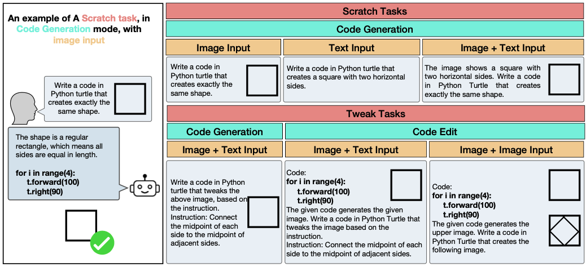
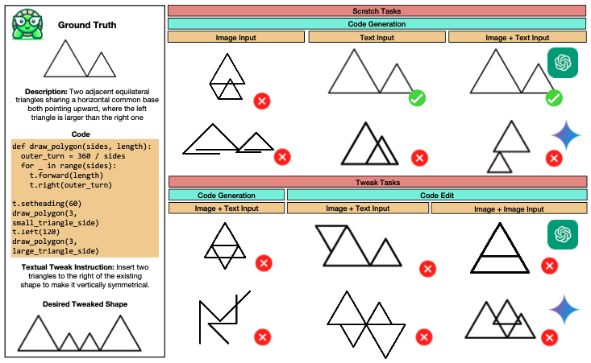
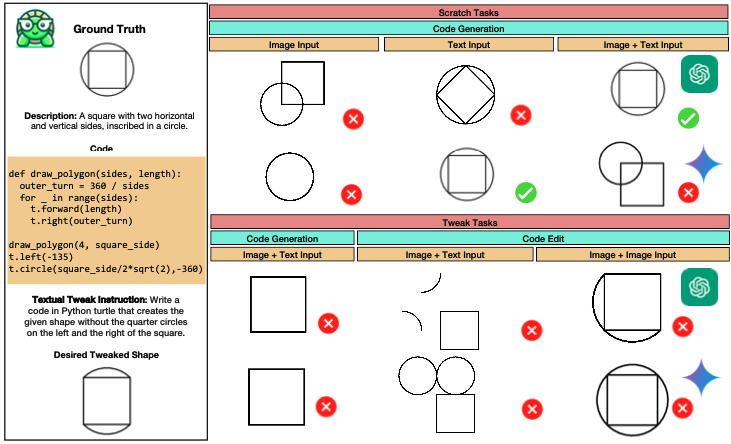
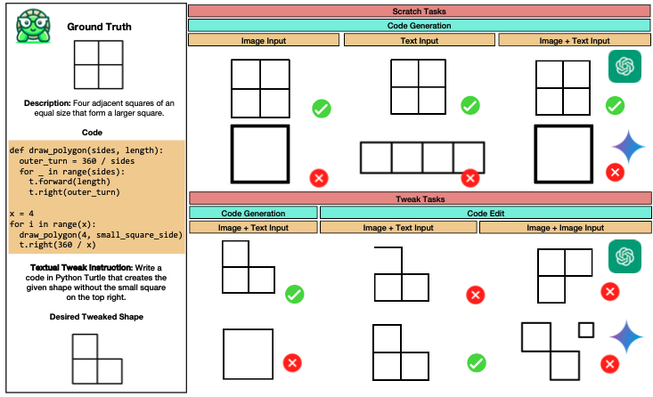

# TurtleBench: A Visual Programming Benchmark in Turtle Geometry


Code for the paper [TurtleBench: A Visual Programming Benchmark in Turtle Geometry]()


<p align="center">
  
</p>

## About TurtleBench
Humans have the ability to reason about geometric patterns in images and scenes from a young age. However, developing large multimodal models (LMMs) capable of similar reasoning remains a challenge, highlighting the need for robust evaluation methods to assess these capabilities. We introduce TurtleBench, a benchmark designed to evaluate LMMs' capacity to interpret geometric patterns---given visual examples, textual instructions, or both---and generate precise code outputs. Inspired by turtle geometry, a notion used to teach children foundational coding and geometric concepts, TurtleBench features tasks with patterned shapes that have underlying algorithmic logic. Our evaluation reveals that leading LMMs struggle significantly with these tasks, with GPT-4V achieving only 19% accuracy on the simplest tasks and few-shot prompting only marginally improves their performance (<2%). TurtleBench highlights the gap between human and AI performance in intuitive and visual geometrical understanding, setting the stage for future research in this area and stands as one of the few benchmarks to evaluate the integration of visual understanding and code generation capabilities in LMMs, setting the stage for future research.




## Benchmark Format
The structure of the files in the `Tasks` directory is as follows:
```
├── {id}
│   ├── QA
│   │   ├── code
│   │   │   ├── q1_code.txt
│   │   │   ├── q2_code.txt
│   │       │
           ...
│   │   └── text
│   │       ├── q1.txt
│   │       ├── q2.txt
│   │       │
           ...
│   ├── description.txt
│   ├── image
│   │   └── {id}.png
│   ├── result_image
│   │   ├── q1_image.png
│   │   ├── q2_image.png
│   │   │
│   │   │
    │   ...  
│   └── variables.txt
│
```
Each directory includes a set of tasks including a base image and queries for different tweak tasks. For consistency of the code provided by the models, the variables needed to create shapes are provided in the `variables.txt` file. For instance, for task 1, this file only contains: 
```
radius=100
```
A task may or may not include `description.txt`. This file contains a text description of the base image (`image/{id}.png`).

In each task, `QA/text/q{i}.txt` for $i > 1$ indicates the `i`th tweak task on the base shape. Accordingly, `QA/text/q1.txt` does not include specific queries, it only includes: "create the exact same shape."

You can add new tasks to the benchmark by adding new folders in the `Tasks` directory, where `id` indicates the number of the new task. 

All tasks are included in `dataset.jsonl` file, which includes all the necessary information for the evaluation. If you add a new task, you need to run the `crawl_tasks.py` file to update the dataset file for the evaluation. 

## Evaluation Results
| Task Type / Modalities | Scratch T | Scratch I | Scratch I + T | Tweak CG I + T | Tweak CG I + T | Tweak CG I + I | Runnable |
|------------------------|-----------|-----------|---------------|-------------|----------------|----------------|----------|
| GPT-4o/basic           | 37.04     | 16.03     | **37.98**     | 17.69   | 18.12   | 12.06       | 99.21          |
| GPT-4o/CoT             | 38.12     | 19.23     | **40.18**     | 20.00   | 19.61   | 13.84       | 99.85          |
| GPT-4o/4-S             | NA        | 21.49     | NA            | NA      | NA      | NA          | 99.85          |
| Gemini/basic           | **25.09** | 7.71      | 22.22         | 3.85    | 12.00   | 3.00        | 99.13          |
| Gemini/CoT             | 18.51     | 9.20      | **20.52**     | 7.10    | 23.08   | 11.84       | 99.94          |
| Gemini/4-S             | NA        | 10.18     | NA            | NA      | NA      | NA          | 99.92          |
| Llava/basic            | **6.01**  | 0.82      | 0.03          | 1.09    | 0.03    | 0.03        | 69.13          |
| Llava/CoT              | **6.22**  | 0.98      | 1.02          | 0.92    | 1.09    | 1.02        | 72.34          |

| Task | GPT-4V basic | Gemini basic | GPT-4V CoT | Gemini CoT |
|------|--------------|--------------|------------|------------|
| **Scratch Code Generation** | | | | |
| Image only Input | 26% | 15% | 29% | 17% |
| Text only Input | 37% | 19% | 38% | 21% |
| Image and Text Input | 38% | 19% | 40% | 21% |


## Prompting
All the prompts used for the evaluation are available in the `prompts.py` file. You can try new prompts by adding to the `system_prompt' dictionary in this file.

## How to Run Evaluation
by running the following script, you can run an evaluation on the model of your choice (current options: GPT4-V and Gemini 1.0 Pro).
It runs the model on a part of benchmark (based on the `task_type` and `task_mode` variables) and reports the accuracy of the model in the file `reports/report.csv`. 

```
python eval.py 
  --model_name # default: gemini, options: gemini (1.5 flash), gpt (4o), and llava (13B)
  --task_type  # default: scratch, options: scratch and tweak
  --task_mode  # default: code_generation, options: code_generation and code_edit
  --modalities # default: image_only, options: "image_only", "text_only", "image+text", and "image+image".
  --prompting_mode # default: cot, options: cot, basic and few-shot (only for Scratch Code Generation)
  --save_responses # Use this option if you want to save the models' responses in the .responses/ directory, if you do not use this argument, it will not store responses
```

If your evaluation was has not been completed due to some reasons, you can run evaluation based on the responses that have been gathered before the termination by: 
```
python calculate_score.py <responses path>
```
It will run the codes and update the results in the reports file. 

## 📈 Examples





<details>
<summary>Click to expand/collapse the examples.</summary>

</details>

<details>
<summary>Click to expand/collapse the examples.</summary>

</details>


## Stay in Touch
Feel free to open merge requests for enhancing TurtleBench.
For any questions, comments and discussions please reach out to me at [srismanc@uci.edu](mailto:srismanc@uci.edu)

## Contributors
This work is done by: [Sina Rismanchian](mailto:srismanc@uci.edu), [Yasaman Razeghi](https://yasamanrazeghi.com/), [Sameer Singh](https://sameersingh.org/), [Shayan Doroudi](https://sites.google.com/uci.edu/shayan-doroudi) at University of California, Irvine
